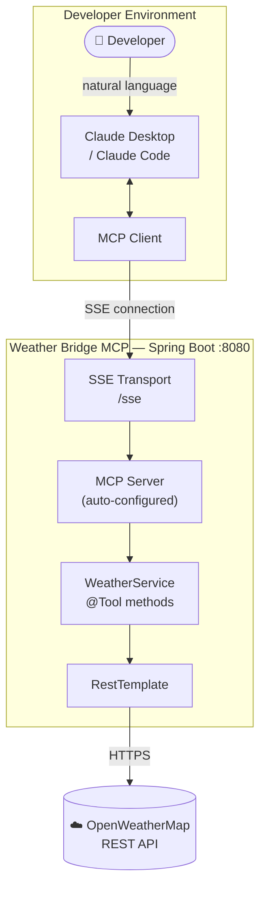
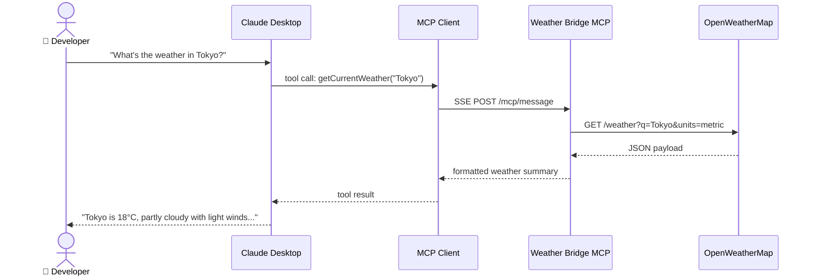
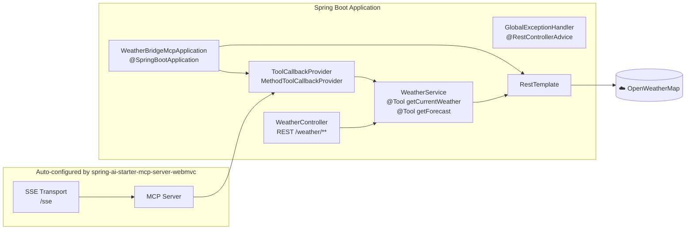
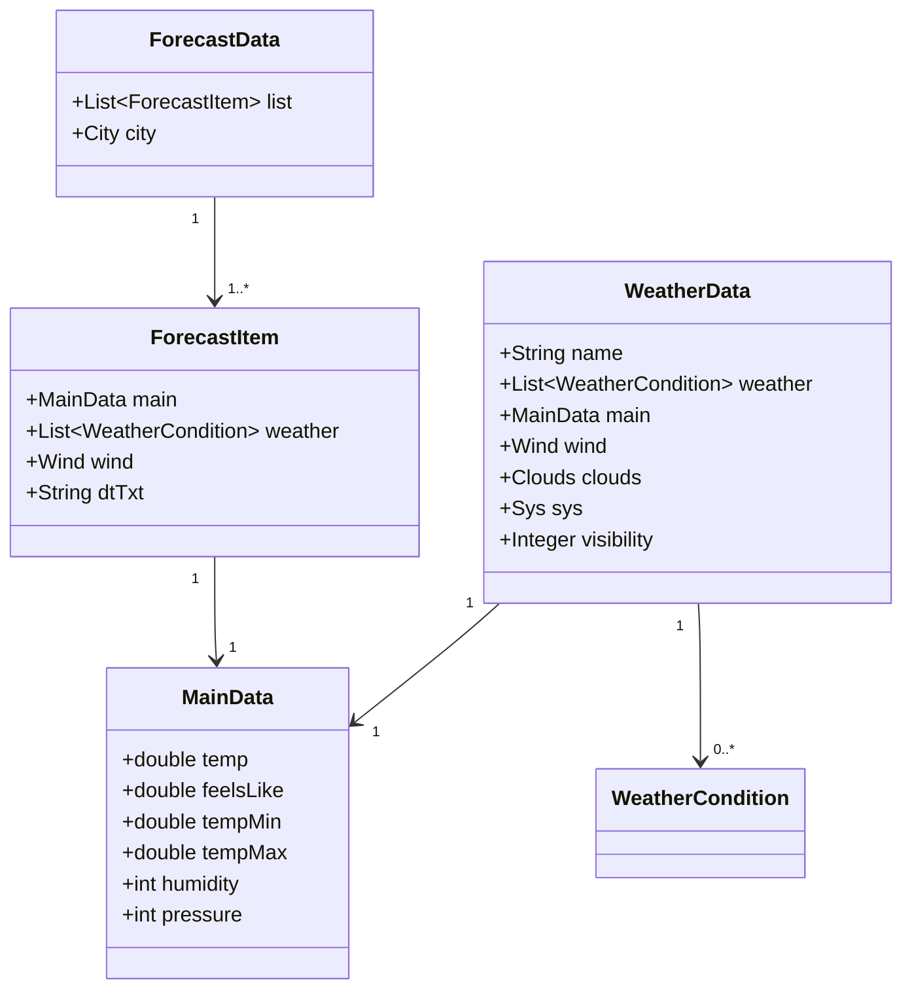

# Weather Bridge MCP

[](https://github.com/mm-camelcase/weather-bridge-mcp/actions/workflows/ci.yml)


[](https://weather-bridge-mcp.fly.dev)


A Spring Boot **Model Context Protocol (MCP) server** that bridges live weather data from [OpenWeatherMap](https://openweathermap.org/api) to AI agents. Connect it to **Claude Desktop** or **Claude Code** and ask weather questions in plain English — the agent calls the right tool automatically.

> **Live demo** — the server is publicly deployed as a GraalVM native image on Fly.io.
> Point Claude Desktop or Claude Code straight at it — no local setup needed:
> ```
> https://weather-bridge-mcp.fly.dev/sse
> ```

```
"What's the weather in Tokyo?" → getCurrentWeather("Tokyo") → 18°C, partly cloudy
"3-day forecast for Berlin?"   → getForecast("Berlin", 3)  → Mon 12°C, Tue 10°C, Wed 14°C
```

---

## Architecture



---

## MCP Tools

| Tool | Description | Parameters |
|------|-------------|------------|
| `getCurrentWeather` | Current conditions for a city | `city` — e.g. `"London"` |
| `getForecast` | Multi-day forecast | `city`, `days` (1–5) |

Both tools return a human-readable summary that the AI model uses to compose its response.

---

## Quick Start

**With Docker** (no Java needed):

```bash
git clone https://github.com/mm-camelcase/weather-bridge-mcp.git
cd weather-bridge-mcp
cp .env.example .env           # add your OPENWEATHERMAP_API_KEY
docker-compose up
```

**Connect Claude Desktop** — add to `~/Library/Application Support/Claude/claude_desktop_config.json`:

```json
{
  "mcpServers": {
    "weather-bridge": {
      "type": "sse",
      "url": "http://localhost:8080/sse"
    }
  }
}
```

Restart Claude Desktop and ask: *"What's the weather in New York?"*

See [`claude-config/README.md`](claude-config/README.md) for Claude Code (CLI) setup instructions.

---

## Getting Started (without Docker)

### Prerequisites

- Java 21+
- Maven 3.9+
- A free [OpenWeatherMap API key](https://openweathermap.org/api)

### Configuration

```bash
cp .env.example .env
# edit .env — set OPENWEATHERMAP_API_KEY=your_key_here
export $(cat .env | xargs)
```

Or set the property directly:

```bash
mvn spring-boot:run -Dopenweathermap.api-key=your_key_here
```

### Run

```bash
mvn spring-boot:run
```

Verify the server is up:

```bash
curl http://localhost:8080/weather/health
# → {"status":"UP","service":"weather-bridge-mcp"}
```

Manual tool testing (no MCP client needed):

```bash
curl "http://localhost:8080/weather/current/London"
curl "http://localhost:8080/weather/forecast/Paris?days=3"
```

---

## How It Works

### Request Flow



### Application Components



### Data Model



---

## Project Structure

```
weather-bridge-mcp/
├── src/main/java/com/example/weatherbridgemcp/
│   ├── WeatherBridgeMcpApplication.java   # Entry point + bean definitions
│   ├── service/
│   │   └── WeatherService.java            # @Tool methods + OpenWeatherMap client
│   ├── model/
│   │   ├── WeatherData.java               # Current weather response model
│   │   └── ForecastData.java              # Forecast response model
│   ├── controller/
│   │   └── WeatherController.java         # REST endpoints for manual testing
│   └── exception/
│       ├── WeatherServiceException.java
│       └── GlobalExceptionHandler.java
├── src/main/resources/
│   ├── application.properties             # Server + MCP + API configuration
│   └── application-dev.properties         # Debug logging profile
├── src/test/                              # Unit tests (MockRestServiceServer)
├── claude-config/                         # Claude Desktop / Claude Code setup
├── Dockerfile                             # GraalVM native multi-stage build
├── docker-compose.yml
├── fly.toml                               # Fly.io deployment config
└── .github/workflows/ci.yml               # GitHub Actions
```

---

## Development

```bash
# Run tests (no API key needed — uses MockRestServiceServer)
mvn test

# Build a fat JAR
mvn clean package -DskipTests

# Build a GraalVM native binary (requires GraalVM JDK 21 installed locally)
mvn -Pnative native:compile -DskipTests

# Run with debug logging
mvn spring-boot:run -Dspring.profiles.active=dev
```

---

## Deploy to Fly.io

The included `Dockerfile` builds a GraalVM native image (~50 MB, ~64 MB RAM at runtime).  
Fly.io's free tier runs it always-on with no cold starts.

**Prerequisites:** [flyctl](https://fly.io/docs/hands-on/install-flyctl/) installed and authenticated.

```bash
# 1. Create the app (first time only — skip on redeploy)
fly launch --no-deploy

# 2. Set your OpenWeatherMap API key as a secret
fly secrets set OPENWEATHERMAP_API_KEY=your_key_here

# 3. Deploy (native build runs inside Fly's remote builder, ~8 min first time)
fly deploy

# 4. Verify
curl https://weather-bridge-mcp.fly.dev/weather/health
```

Once deployed, add the public SSE URL to Claude Desktop:

```json
{
  "mcpServers": {
    "weather-bridge": {
      "type": "sse",
      "url": "https://weather-bridge-mcp.fly.dev/sse"
    }
  }
}
```

---

## Environment Variables

| Variable | Required | Description |
|----------|----------|-------------|
| `OPENWEATHERMAP_API_KEY` | Yes | API key from [openweathermap.org](https://openweathermap.org/api) |

---

## Resources

- [Model Context Protocol (MCP) Documentation](https://modelcontextprotocol.io/docs)
- [Spring AI MCP Server Reference](https://docs.spring.io/spring-ai/reference/api/mcp/mcp-server-boot-starter-docs.html)
- [OpenWeatherMap API Documentation](https://openweathermap.org/api)
- [Claude Desktop MCP Guide](https://docs.anthropic.com/claude/docs/mcp)

---

## License

[MIT](LICENSE) © 2025 mm-camelcase
