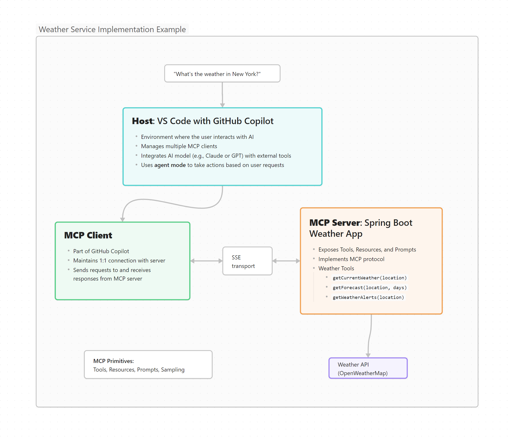

# Weather Bridge MCP

A Spring Boot implementation of the Model Context Protocol (MCP) that enables AI agents like GitHub Copilot to access weather data. Demonstrates building a custom MCP server that connects AI models to weather APIs through standardised tools, complete with VS Code integration examples.

## Overview

This project demonstrates how to build a custom MCP server using Spring Boot that allows AI agents like GitHub Copilot to access weather data. The server exposes weather data through MCP tools that GitHub Copilot can use in agent mode to answer questions about weather conditions, forecasts, and alerts.

## MCP Architecture



## Project Structure

```
weather-bridge-mcp/
├── src/
│   ├── main/
│   │   ├── java/com/example/weatherbridgemcp/
│   │   │   ├── WeatherBridgeMcpApplication.java  # Main Spring Boot application
│   │   │   ├── config/
│   │   │   │   ├── McpServerConfig.java          # MCP server configuration
│   │   │   │   └── AppConfig.java                # General application config
│   │   │   ├── model/
│   │   │   │   ├── WeatherData.java              # Weather data model classes
│   │   │   │   └── ForecastData.java             # Forecast data model classes
│   │   │   ├── service/
│   │   │   │   └── WeatherService.java           # Service to call external Weather API
│   │   │   ├── mcp/
│   │   │   │   └── WeatherToolProvider.java      # MCP tool provider implementation
│   │   │   └── controller/
│   │   │       └── WeatherController.java        # Optional REST controller for testing
│   │   └── resources/
│   │       └── application.properties            # App configuration properties
│   └── test/                                     # Test classes
├── pom.xml                                       # Maven configuration
└── vscode-config/                                # VS Code configuration examples
    └── mcp.json                                  # Example MCP configuration for VS Code
```

## TODO List

This is a project template. To complete the implementation, follow these steps:

1. Set up the basic Spring Boot project using Spring Initializer
2. Add Spring AI MCP dependencies to the pom.xml
3. Implement the Weather API client (WeatherService.java)
4. Configure the MCP server (McpServerConfig.java)
5. Implement MCP tools (WeatherToolProvider.java)
6. Create model classes for weather data
7. Configure VS Code to connect to your MCP server
8. Test with GitHub Copilot agent mode

## Implementation Guide

### Step 1: Set up Spring Boot Project

Create a new Spring Boot project using Spring Initializer (https://start.spring.io/) with the following settings:
- Project: Maven
- Language: Java
- Spring Boot: Latest stable version
- Dependencies: Spring Web, Spring Boot DevTools, Lombok (optional)

### Step 2: Add MCP Dependencies

Add the following dependencies to your `pom.xml`:

```xml
<dependencies>
    <!-- Spring Boot -->
    <dependency>
        <groupId>org.springframework.boot</groupId>
        <artifactId>spring-boot-starter-web</artifactId>
    </dependency>
    
    <!-- Spring AI MCP -->
    <dependency>
        <groupId>org.springframework.experimental</groupId>
        <artifactId>spring-ai-mcp-core</artifactId>
        <version>0.1.0</version>
    </dependency>
    
    <!-- WebMVC SSE transport -->
    <dependency>
        <groupId>org.springframework.experimental</groupId>
        <artifactId>mcp-webmvc-sse-transport</artifactId>
        <version>0.1.0</version>
    </dependency>
    
    <!-- JSON processing -->
    <dependency>
        <groupId>com.fasterxml.jackson.core</groupId>
        <artifactId>jackson-databind</artifactId>
    </dependency>
    
    <!-- Lombok for reducing boilerplate code -->
    <dependency>
        <groupId>org.projectlombok</groupId>
        <artifactId>lombok</artifactId>
        <optional>true</optional>
    </dependency>
</dependencies>
```

### Step 3: Implement Weather Service

Create a service to interact with an external weather API (like OpenWeatherMap):

```java
import org.springframework.stereotype.Service;
import org.springframework.web.client.RestTemplate;
import org.springframework.beans.factory.annotation.Value;

@Service
public class WeatherService {
    private final RestTemplate restTemplate;
    private final String apiKey;
    private final String baseUrl;

    public WeatherService(
            RestTemplate restTemplate,
            @Value("${openweathermap.api-key}") String apiKey,
            @Value("${openweathermap.base-url}") String baseUrl) {
        this.restTemplate = restTemplate;
        this.apiKey = apiKey;
        this.baseUrl = baseUrl;
    }

    public WeatherData getCurrentWeather(String city) {
        String url = String.format("%s/weather?q=%s&appid=%s&units=metric", 
                                  baseUrl, city, apiKey);
        return restTemplate.getForObject(url, WeatherData.class);
    }

    public ForecastData getForecast(String city, int days) {
        String url = String.format("%s/forecast?q=%s&appid=%s&units=metric&cnt=%d", 
                                  baseUrl, city, apiKey, days * 8); // 8 forecasts per day (3-hour steps)
        return restTemplate.getForObject(url, ForecastData.class);
    }
}
```

### Step 4: Configure MCP Server

Set up the MCP server configuration:

```java
import org.springframework.ai.mcp.server.McpServer;
import org.springframework.ai.mcp.server.transport.http.HttpServletSseServerTransportProvider;
import org.springframework.context.annotation.Bean;
import org.springframework.context.annotation.Configuration;
import org.springframework.web.servlet.config.annotation.EnableWebMvc;
import org.springframework.web.servlet.config.annotation.WebMvcConfigurer;
import com.fasterxml.jackson.databind.ObjectMapper;
import org.springframework.boot.web.servlet.ServletRegistrationBean;

@Configuration
@EnableWebMvc
public class McpServerConfig implements WebMvcConfigurer {

    @Bean
    public McpServer mcpServer(WeatherToolProvider weatherToolProvider) {
        return McpServer.builder()
                .withToolProvider(weatherToolProvider)
                .build();
    }

    @Bean
    public HttpServletSseServerTransportProvider servletSseServerTransportProvider() {
        return new HttpServletSseServerTransportProvider(new ObjectMapper(), "/mcp/sse");
    }

    @Bean
    public ServletRegistrationBean<HttpServletSseServerTransportProvider> sseServlet(
            HttpServletSseServerTransportProvider transportProvider) {
        return new ServletRegistrationBean<>(transportProvider, "/mcp/sse");
    }
}
```

### Step 5: Implement MCP Tools

Create the MCP tool provider to expose weather tools:

```java
import org.springframework.ai.mcp.server.tool.McpServerToolProvider;
import org.springframework.ai.mcp.server.tool.McpServerToolType;
import org.springframework.ai.mcp.server.tool.McpServerTool;
import org.springframework.stereotype.Component;

@Component
@McpServerToolType(name = "weather", description = "Tools for retrieving weather information")
public class WeatherToolProvider implements McpServerToolProvider {

    private final WeatherService weatherService;

    public WeatherToolProvider(WeatherService weatherService) {
        this.weatherService = weatherService;
    }

    @McpServerTool(
        name = "getCurrentWeather",
        description = "Get the current weather for a specific city",
        inputSchema = "{\"type\":\"object\",\"properties\":{\"city\":{\"type\":\"string\"}},\"required\":[\"city\"]}"
    )
    public WeatherData getCurrentWeather(String city) {
        return weatherService.getCurrentWeather(city);
    }

    @McpServerTool(
        name = "getForecast",
        description = "Get the weather forecast for a specific city for a number of days",
        inputSchema = "{\"type\":\"object\",\"properties\":{\"city\":{\"type\":\"string\"},\"days\":{\"type\":\"integer\",\"minimum\":1,\"maximum\":5}},\"required\":[\"city\",\"days\"]}"
    )
    public ForecastData getForecast(String city, int days) {
        return weatherService.getForecast(city, days);
    }
}
```

### Step 6: Create Model Classes

Create model classes for weather data:

```java
import com.fasterxml.jackson.annotation.JsonProperty;
import lombok.Data;
import java.util.List;

@Data
public class WeatherData {
    private Coordinates coord;
    private List<Weather> weather;
    private String base;
    private MainData main;
    private long visibility;
    private Wind wind;
    private Clouds clouds;
    private long dt;
    private Sys sys;
    private int timezone;
    private long id;
    private String name;
    private int cod;

    @Data
    public static class Coordinates {
        private double lon;
        private double lat;
    }

    @Data
    public static class Weather {
        private long id;
        private String main;
        private String description;
        private String icon;
    }

    @Data
    public static class MainData {
        private double temp;
        @JsonProperty("feels_like")
        private double feelsLike;
        @JsonProperty("temp_min")
        private double tempMin;
        @JsonProperty("temp_max")
        private double tempMax;
        private int pressure;
        private int humidity;
    }

    @Data
    public static class Wind {
        private double speed;
        private int deg;
        private double gust;
    }

    @Data
    public static class Clouds {
        private int all;
    }

    @Data
    public static class Sys {
        private int type;
        private long id;
        private String country;
        private long sunrise;
        private long sunset;
    }
}
```

### Step 7: Main Application Class

```java
import org.springframework.boot.SpringApplication;
import org.springframework.boot.autoconfigure.SpringBootApplication;
import org.springframework.context.annotation.Bean;
import org.springframework.web.client.RestTemplate;

@SpringBootApplication
public class WeatherBridgeMcpApplication {

    public static void main(String[] args) {
        SpringApplication.run(WeatherBridgeMcpApplication.class, args);
    }

    @Bean
    public RestTemplate restTemplate() {
        return new RestTemplate();
    }
}
```

### Step 8: Configure Application Properties

Create an `application.properties` file:

```properties
server.port=8080
openweathermap.api-key=YOUR_API_KEY_HERE
openweathermap.base-url=https://api.openweathermap.org/data/2.5
```

### Step 9: VS Code Integration

Create a `.vscode/mcp.json` file in your VS Code workspace:

```json
{
  "inputs": [],
  "servers": {
    "WeatherBridgeMcp": {
      "type": "sse",
      "url": "http://localhost:8080/mcp/sse"
    }
  }
}
```

## Running the Project

1. Get an API key from OpenWeatherMap (or another weather API)
2. Add your API key to `application.properties`
3. Build and run the Spring Boot application
4. Open VS Code and configure it with the MCP settings
5. Use GitHub Copilot agent mode to ask weather-related questions

## Testing in GitHub Copilot

Once your server is running, you can test it with GitHub Copilot by:

1. Opening GitHub Copilot
2. Activating Agent Mode
3. Selecting your Weather MCP tools
4. Asking questions like "What's the current weather in New York?" or "Give me the 5-day forecast for London"

## Resources

- [Model Context Protocol (MCP) Documentation](https://modelcontextprotocol.io/docs)
- [Spring AI MCP Reference](https://docs.spring.io/spring-ai/reference/api/mcp/mcp-overview.html)
- [OpenWeatherMap API Documentation](https://openweathermap.org/api)
- [GitHub Copilot Documentation](https://docs.github.com/en/copilot)
